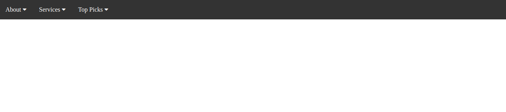
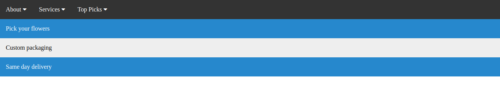
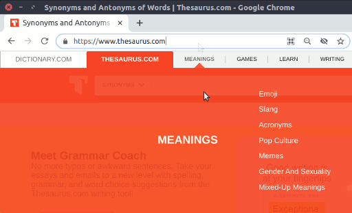

# Dropdown Menu

**Instructions**
1. Create a navigation bar at the top of the page with three items:
  * About
  * Services
  * Top Picks

2. When the user hovers over one of these items, a drop down should appear with further options:
  * About: Florists, Meet the team, Careers
  * Services: Pick your flowers, Custom packaging, Same day delivery
  * Top Picks: Tulips, Lilies, Roses

3. The user should be able to hover over the dropdown items and receive visual feedback.

4. There should be a slight delay before a menu opens, so that you can pass quickly, for example, from the About tab to the Top Picks tab without the Services tab opening on the way.

(See [Thesaurus.com](https://www.thesaurus.com/) for an example of where this is *not* done, and where moving the mouse from the address bar to the Synonyms input field is likely to open a menu item that blocks access to the Synonyms field.)

